# ATAK-handbok

Praktisk handhavandebeskrivning för ATAK, med tips och felsökning.
Bilderna kommer från TAK-utbildningen; kursupplägg, metodikavsnitt och
övningsuppgifter är bortplockade.

Visas som bildspel via [viewer.html](viewer.html?deck=handbok).

## ATAK-specifika styrningar

ATAKs uppbyggnad sätter vissa gränser. En av dem är färgsättning av team:
standardfärgerna GUL, GRÖN, LJUSBLÅ och RÖD är reserverade eftersom de
finns som standard i TAK för markörer.

Funktionen `#` ger bredd i hanteringen — till exempel `#Sjukvårdare`,
`#Ordonnans`.

### Färgsättning

Färgerna nedan syns mot olika kartunderlag. Hemvärnets förslag:

| Nivå | Färg |
|---|---|
| **Bataljon** | OMR = SVART, TEAM = BRUN |
| **Kompani** (OMR/teamfärg) | 1:A VIT · 2:A ORANGE · 3:E ROSA (Magenta) · 4:E GRÅBLÅ/TEAL |
| **Pluton** (OMR/teamfärg) | 1:A LILA · 2:A BLÅ · 3:E MÖRKRÖD/MAROON · 4:E MÖRK GRÖN |
| **Grupp/team** | GRP 1–4, samma som plutonfärgen |

Övrig färgmarkering, TAK-standard för markörer:

| Färg | Betydelse |
|---|---|
| LJUSBLÅ | Vänlig / friendly |
| LJUSGRÖN | Neutral |
| GUL | Okänd / unknown |
| RÖD | Fientlig / hostile |

Reservfärgmarkering: **MÖRKBLÅ**.

---

## Grundlayout

Kartvyn har fyra funktionsytor:

* **Navigering**
* **Egen positionering**
* **Snabbmeny**
* **Menyträd**

Kartan fungerar som en GPS — du kan rotera, vinkla och låsa på din
position. Manövrering sker med tryck, tryck-och-håll och två fingrar.

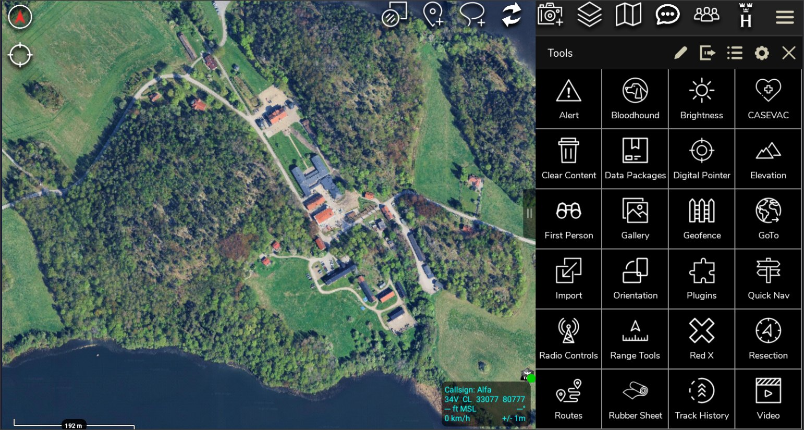
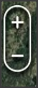

---

## Snabbmeny
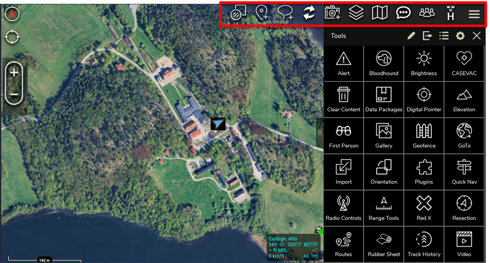

- Funktioner användaren ofta använder och vill ha åtkomst till snabbt.
- Användaren kan själv välja vad användaren vill ha tillgängligt, genom att klicka på pennan och editera menyn eller dra en ny funktion till snabbmenyn
- Därefter spara med disketten

---

## Menyträd/tools (”Hamburgerikonen” uppe till höger)

- Navigera menyn genom att scrolla.
- Samlingsplats för samtliga verktyg (Tools).
- Alla Tools kommer inte vara användbara för dig och din enhet.

---

## Lägg in ditt Callsign (ENLIGT FAL-A)och teamfärg:(”Hamburgerikonen” uppe till höger)
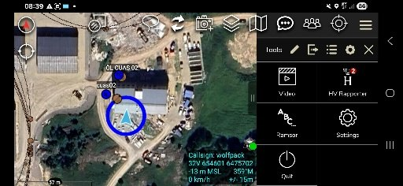
- Klicka på  ”Hamburgaren”
- scrolla till Settings
Ange enligt FAL-A
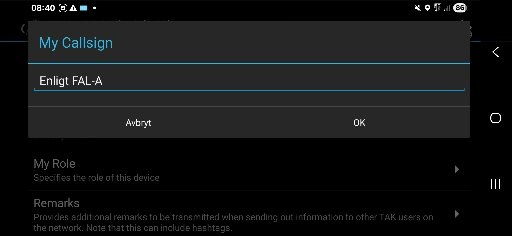
Välj: Callsign and Device Preferences
- Välj: My Team
- Välj: Färg enligt färgsättning
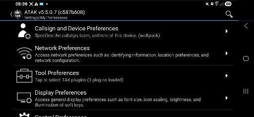

- Välj: Remarks
- Ange en Hashtag (tex #Sjukvård)
- Backa 3ggr till ren kartbild
Välj: Callsign Preferences

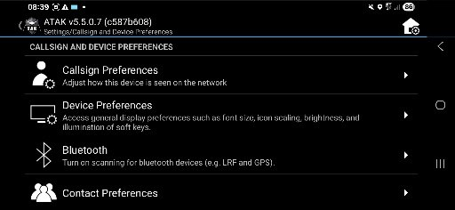
Välj: My Callsign
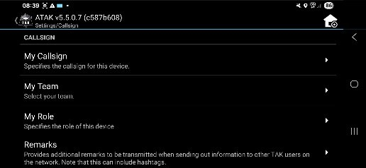
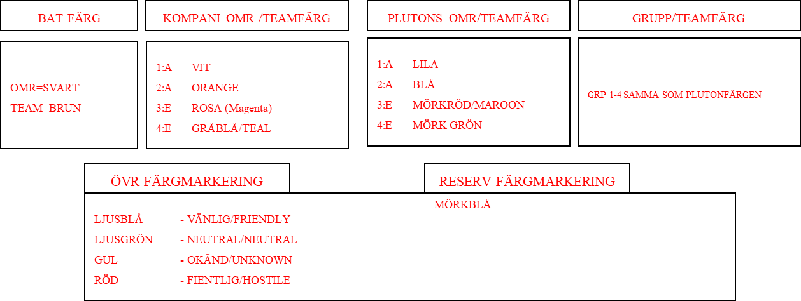

---

## Tools: Maps
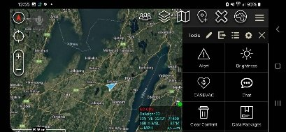

MAPS där samlas alla tillgängliga kartor, här kan man välja olika kartunderlag
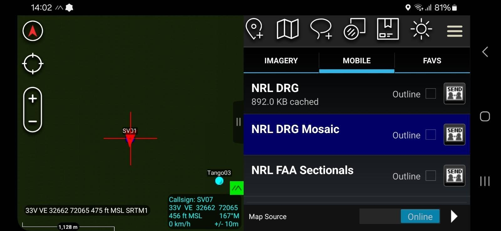
Se till att det står ONLINE nere till höger i rutan.

---

## Tools: Maps

- Dags att lägga in karta: (bör vara samma på alla enheter)
- Rekommenderad:
- Google Hybrid
- Google Sattelite Only
- Open TOPO
- Kartor av olika slag kan läggas till i systemet tex sjökort, mm filformatet är .xml
- Det är på gång kartor i andra format.
- Även en online kardataserver mot geodata

---

## Navigation
Klartext: ”Enklare inställningar för hur användaren ser, och använder sin egen position på kartan”
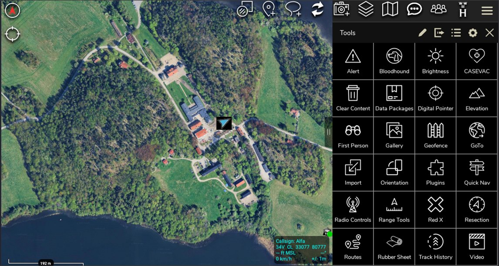
-  Kompassriktning
-  Egen position.
-  Zoom in/ut.
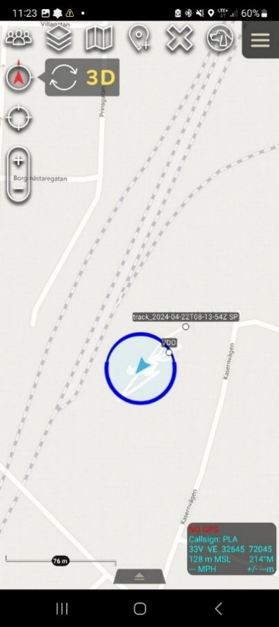

Tryck och håll in kompassriktning för att ändra.
Rotation: Vit = AV, Gul = På, Hänglås = Låst
3D: Vit = AV, Gul = På, Hänglås = Låst
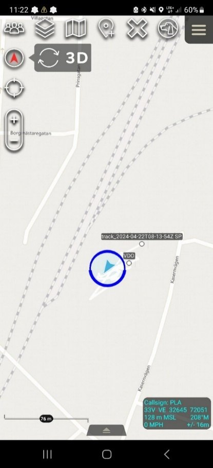
Ändringar av kartans positionering görs med tvåfingersmanöver.
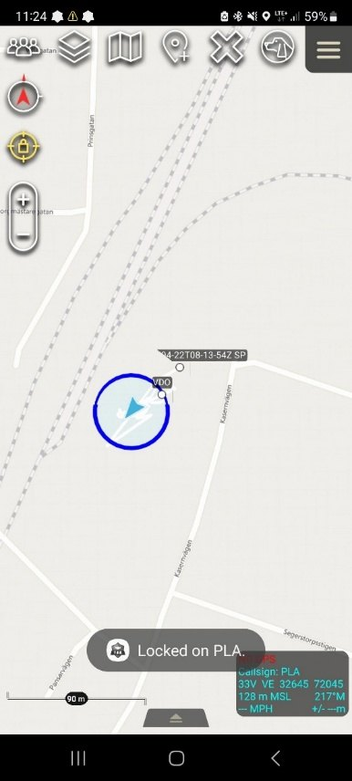
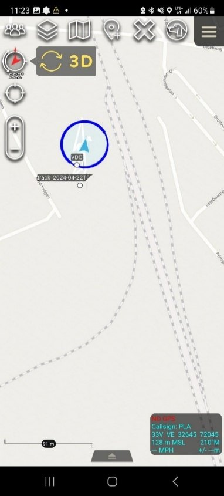
- Egen position.
- Vit = Fri rörelse.
- Gul = Fast på egen pos.
För att ändra från Gul=låset till Vit håll in ikonen ca 1 sek
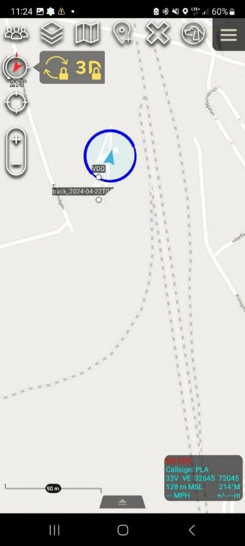

---

## Egen position
- Återgå till egen position
- (Om gul med hänglås i studsar man alltid tillbaka till sin position)
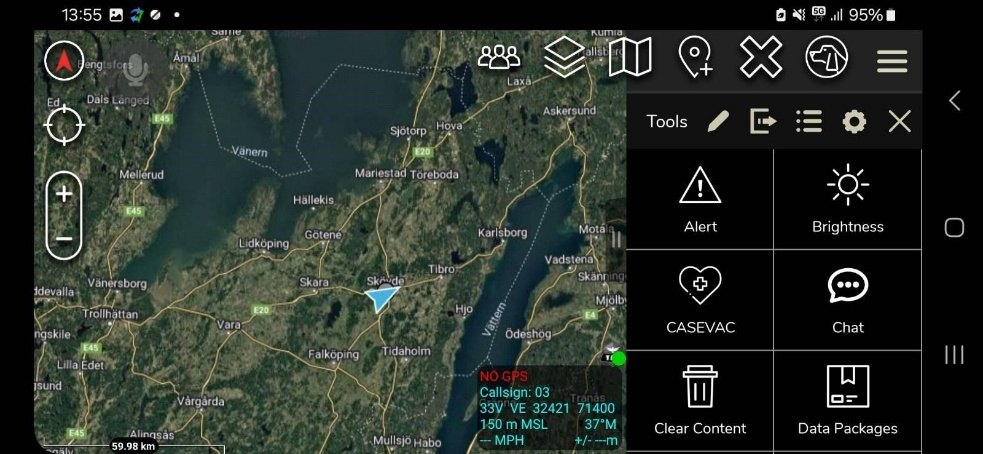
Klartext: ”Vart jag är, koordinater”.
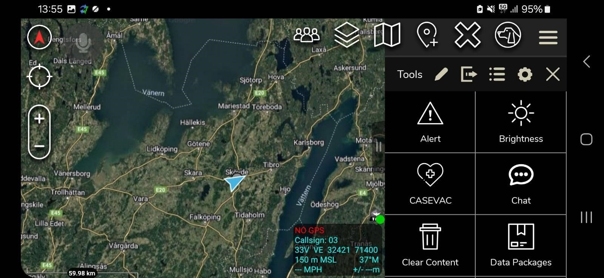
- Callsign: Ditt namn
- MGRS koordinat
- Höjd
- Hastighet
- Genom att klicka på denna ruta kan man ändra vilken information som man vill visa om egen position

---

## HUR KOMMUNICERAR MAN I TAK OCH VAD
- Vilka kommunikationssätt  finns?
  - CHAT (ej uppdaterad info, ), textmeddelanden med bifogad fil
    - CHATROOMS
    - GRUPPER
    - TEAMS
    - DIREKT TILL ANNAN TAK ENHET
  - FEED (typ av chat)(uppdaterad info,) med bifogad fil
    - Synkroniserad kommunikation mellan olika takenheter
    - Tänk social media tråd
    - All information ses av all och uppdateras när man skickar via ”lasso”,  det du ser är det aktuella läget
    - För att FEED skall fungera måste enheterna ha ATAK-SYNK installerad
  - VAD: Pointdroppers, Vägar, OLEAT, DATAPAKET mm
  - SERVER SYNC: allt man lägger på kartan autosynkas till alla
  - Minskad radiokommunikation.
  - Vid AKUT kommunikation använd radio!

---

## Tools: Contacts
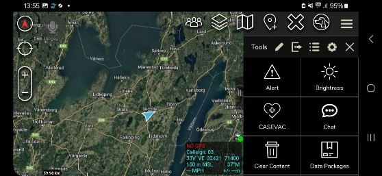
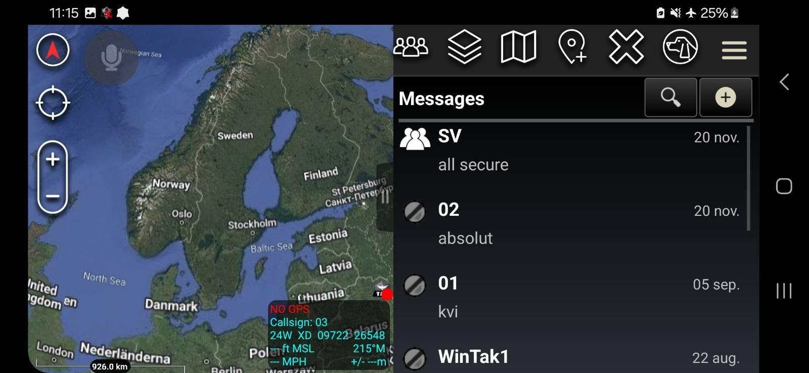
- CONTACTS låter användaren kontakta andra användare på olika sätt.
- Chatt funktionen är likt vanliga sms. Du kan välja att friskriva eller nyttja de kortkommandon som finns inlagda för snabb kommunikation.
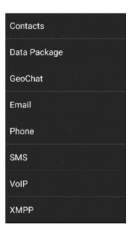
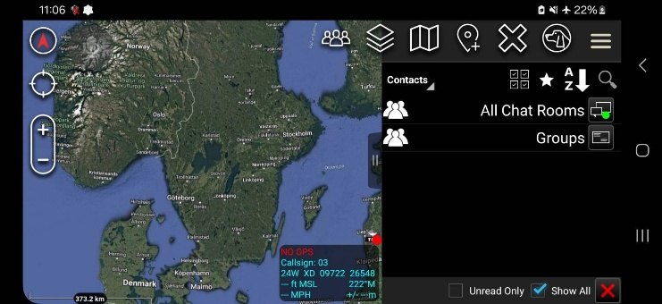
Skapa en gruppchatt för att enkelt kommunicera inom enheten.

---

## Skicka information/ändringar på kartan: (utgå från standard rutiner, hur rapporterar jag via radio)
- Kommunikation med andra (Chatt) av information/ändringar på kartan:
  - Rita/lägg ut pointdropper/det du vill förmedla
  - Klicka på kontakter/Contacts – hitta din mottagare
  - Klicka på ikonen längst ut till höger med 2 rutor (du kommer till Chatfönstret)
  - Vill du bifoga något klicka sedan på Gemet (angiven text på textrad försvinner)
  - Välj det alternativ som passar bäst
  - Klicka done uppe till höger och meddelandet skickas
- Kommunicera lägesförändring eller specifika ikoner på kartan via Feed:
  - Rita/lägg ut pointdropper/det du vill förmedla – skicka till FEED
  - Rita – Ringa in med Lasso – skicka till specifik FEED

---

## Tools: point dropper

- POINT DROPPER är ett verktyget där användaren kan placera ut  olika markörer på kartan.
- ATAK har flertalet olika markör-typer inlagda.
- Alla ikoner finns inte så namngivning är viktigt
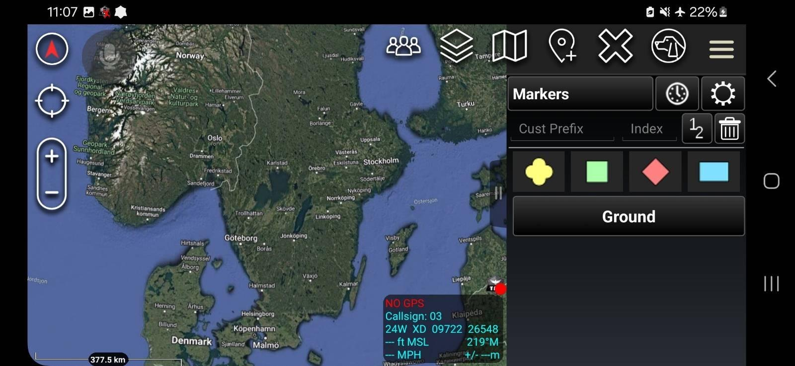
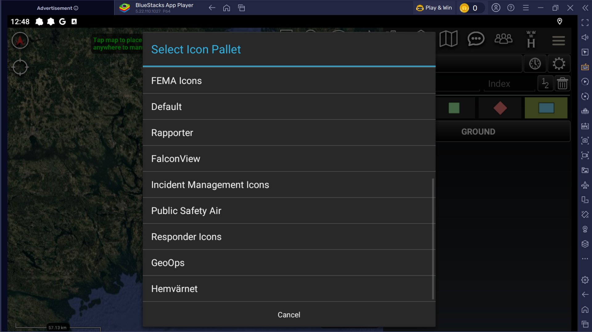
- Om man klickar på Markers så kommer det fler alternativ, tex Rapporter med 8S
- Man kan även välja Hemvärnets ikoner
- Kommentar: Att placera ut markörer på kartan med lämplig titel är ett mycket bra sätt att kommunicera.
- Stridsställningar, FI, andra viktiga punkter.

---

## Tools: Point dropper

- NAMN = CALLSIGN-TNR-HÄNDELSE
- EX: QA-241215-GRUPPERING 1
- EX: QA-241231-GRUPPERING 2
- EX: QA-241500-REKADE VÄGAR
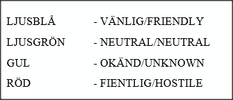

---

## Radial meny
RADIAL MENY är en funktion vissa markörer innehar för att komma åt den tryck på din egen positionsmarkör eller andra markörer.
I RADIAL MENYN går det att fin justera eller få tillgång till ytterligare information.
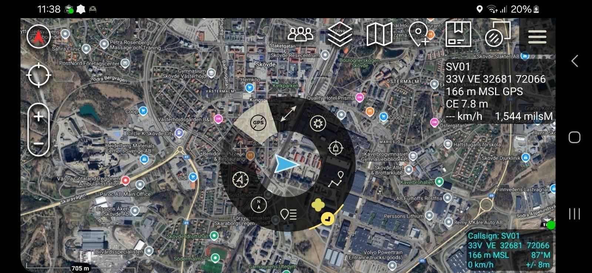
Kommentar: Olika markörer har olika funktioner inom RADIAL MENY, experimentera själv och se vad för funktioner just denna markören har.

---

## Radial meny för egen position och markör

Radial meny är en funktion vissa markörer har. Tryck på din egen
positionsmarkör eller på en annan markör för att öppna den. När en
funktion aktiverats blir den markerad.

Funktioner med **gul ytterkant** har ytterligare alternativ — håll inne
för att se dem.

### För egen position

1. Markör Info
2. Kompass
3. Polär markör
4. Fin justering
5. GPS AV/PÅ
6. R&B Line
7. Threat Rings
8. Lås Pos
9. Spårbildning

### För markör

1. Radera
2. Polär markör
3. Fin justering
4. R&B Line
5. Lås Pos
6. Skapare
7. Threat Rings
8. Spårbildning
9. Markör Info

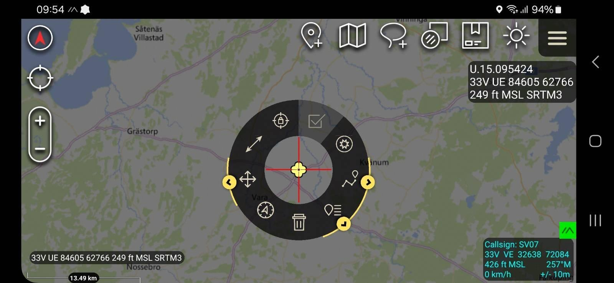

---

## Tools: point dropper

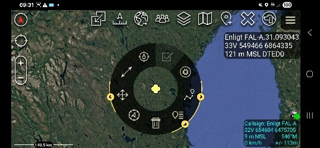
- Radial menyn öppnas klicka på
- för att redigera information
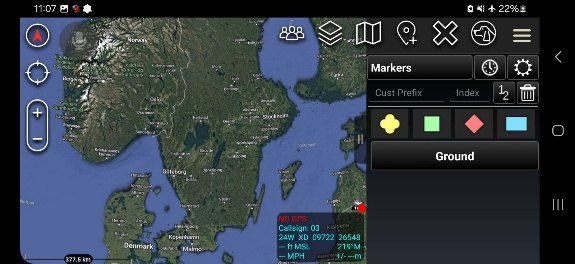
Välj PointDropper
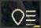
Markerad blir gulmarkerad, Klicka i kartan för att lägga ut den
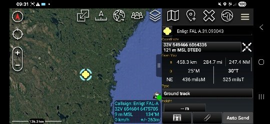
Namnge Ikonen genom att klicka brevid ikonen
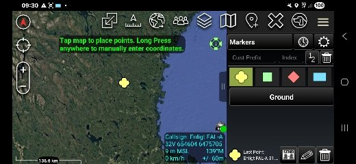
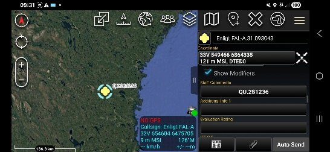
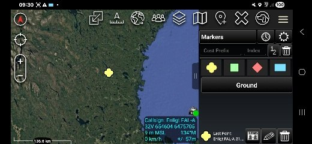
Bocka i: Show Modifiers
Avmarkera PointDropper eller backa ur med pil bakåt
Under STAFF COMMENT: lägg till information som visas bredvid ikonen
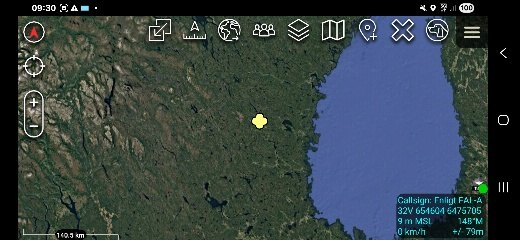
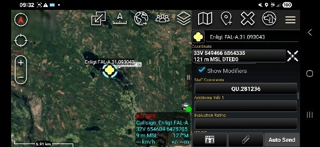
Du kan nu klicka på ikonen du lagt ut

---

## Tools: Drawing tools
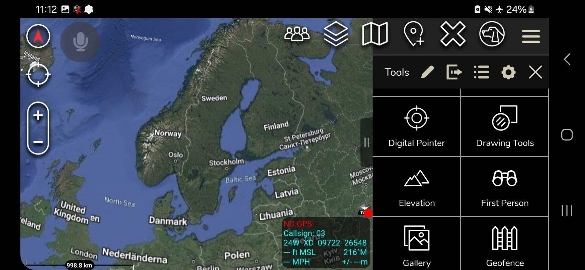
DRAWING TOOLS låter användaren markera ut olika geometriska former i ATAK.
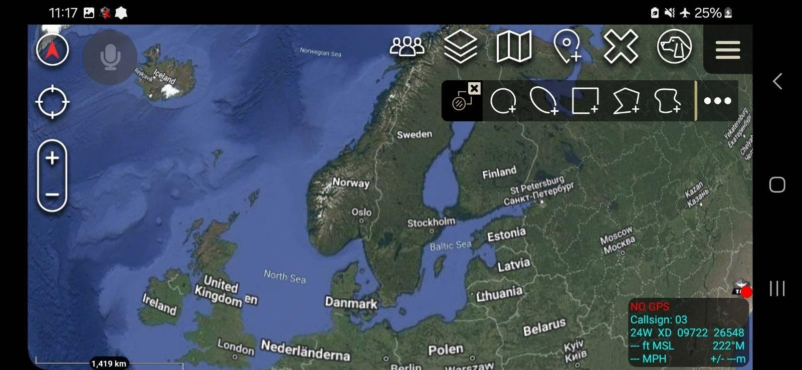
Kan användas för tex grupperingsområden, vägar, stridsställningar, mineringsområden mm

---

## Tools: LASSO
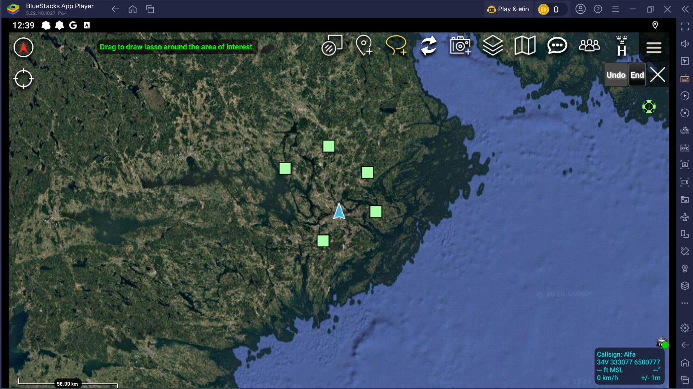
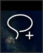
- LASSO funktionen ger dig möjlighet att ringa in flera objekt och på ett enkelt sätt skicka detta vidare, radera eller spara det som tex ett DATAPAKET
- Genom att välja lasso och sedan ringa in objekt, får man valen att skicka, spara mm
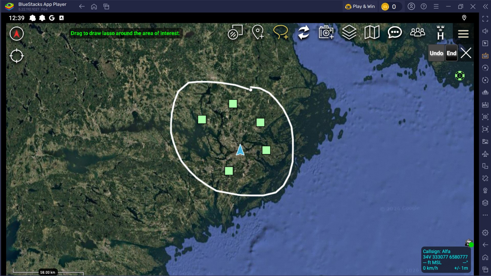
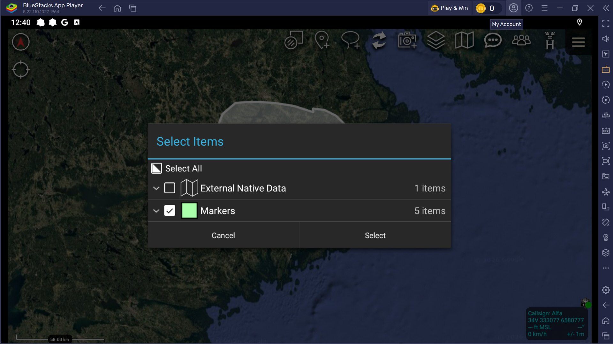
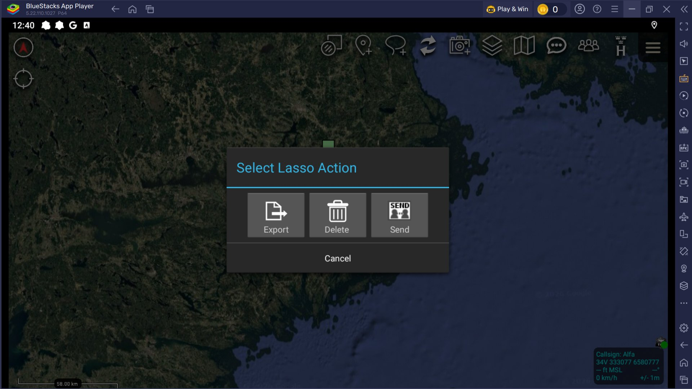

---

## Tools: Data packages
DATA PACKAGES nyttjas för att komprimera data, och skicka till det utvald mottagare.
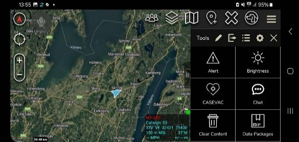
- Se data packet som folder/dokument/filer på en dator
- Utgångsgrupperingar, ordrar, färdvägar mm
- Kan med fördel skickas som FEED så att all info alltid är uppdaterad

Kommentar: Enkelt och smidigt för chefer att sprida tex kommande grupperingsområden , kommande fasta uppgifter mm

---

## Tools: Data packages

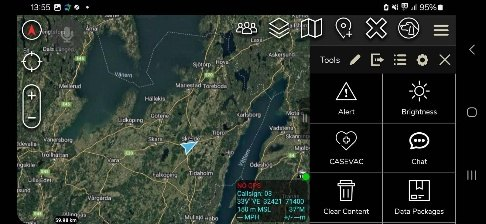

Ikonerna i DATA PACKAGES-vyn:

| Ikon | Funktion |
|---|---|
| **Plus** | Skapa ett nytt data package |
| **Download** | Ladda ner tidigare data package från TAK-servern |
| **Transfer Log** | Visa tidigare skickade och mottagna data package |
| **Multi Select Action** | Öppnar ”Overlay Manager” — extrahera eller radera flera data package |
| **Sök** | Hitta ett efterfrågat data package |

---

## Tools: Digital pointer
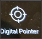
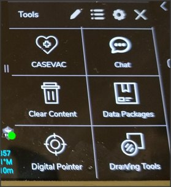
Med Digital pointer kan man snabbt påkalla andras uppmärksamhet till ett speciellt objekt (man ser inte själv linjen)
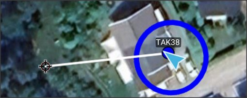
- DigitDigital Pointer: uppgift
- Sätt ut en digital pointer
- Ta bort pointer
- Obs! Den som skapat Digital pointer
- Är den som måste ta bort den

---

## Tools: 8S (A-I, Fordon, METHANE)
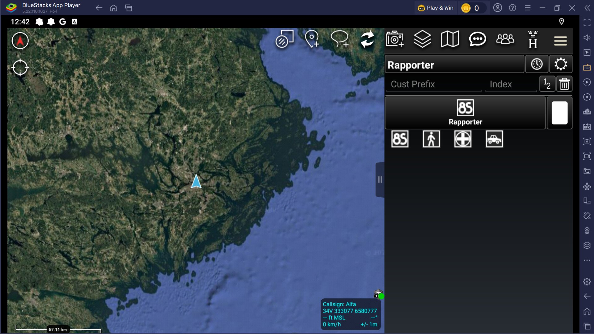
- Ligger under Pointdropper och Rapporter:
- Nulägesrapport via ATAK
- CS och TNR sätts automatiskt
Du klickar på kartan där du vill att ikonen skall placeras.
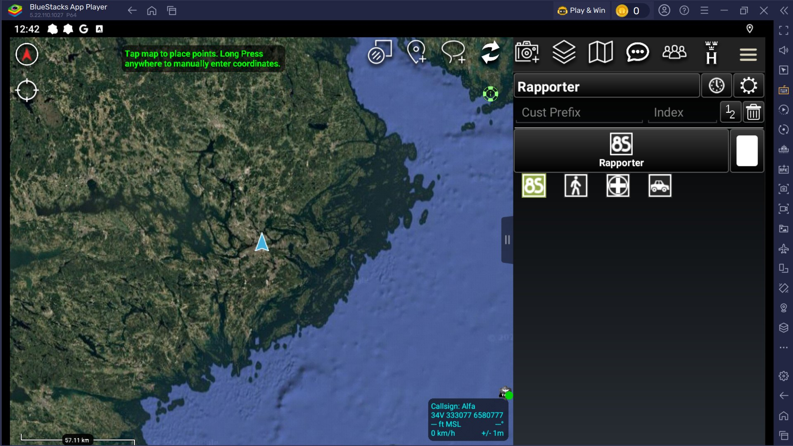
- Fyll i informationen, klicka done och en 8S (samma gäller alla rapporter) kommer att synas på kartan. Den kan nu skickas till berörd enhet/person
- Hamnar under HV rapporter för historik
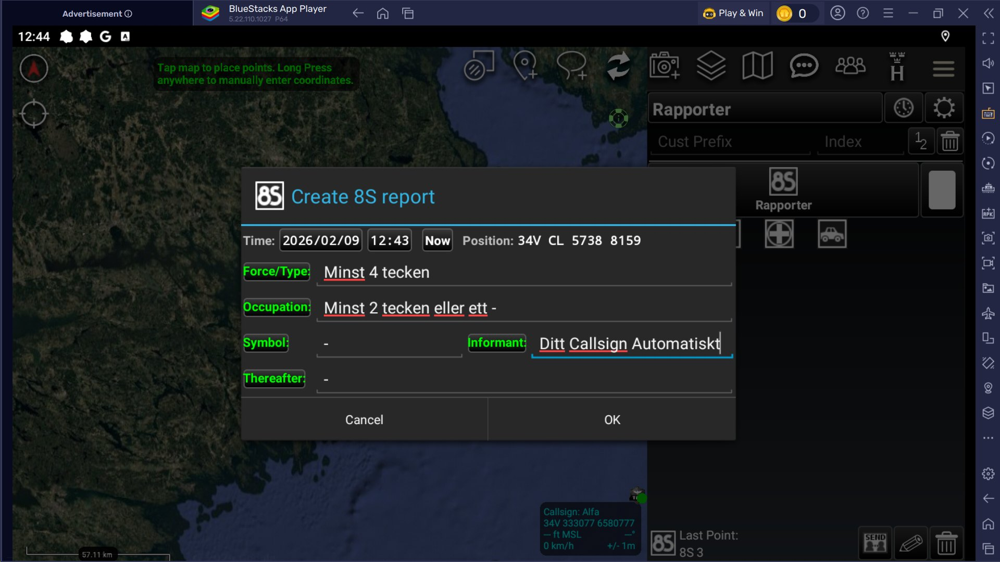

---

## PEDARS & FORS
- Är knuten till den Blåa pointdropper ikonen
- Markera ikonen och välj dess funktioner
- Fyll i PEDARS & FORS, skicka till berörd enhet/person
- Under HV - Rapporter kan man se vad som kommit in
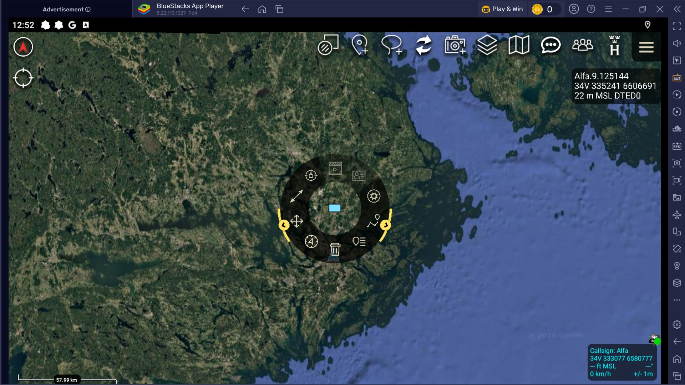
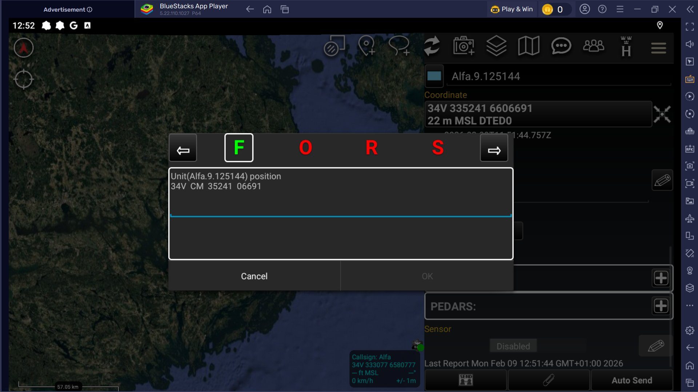
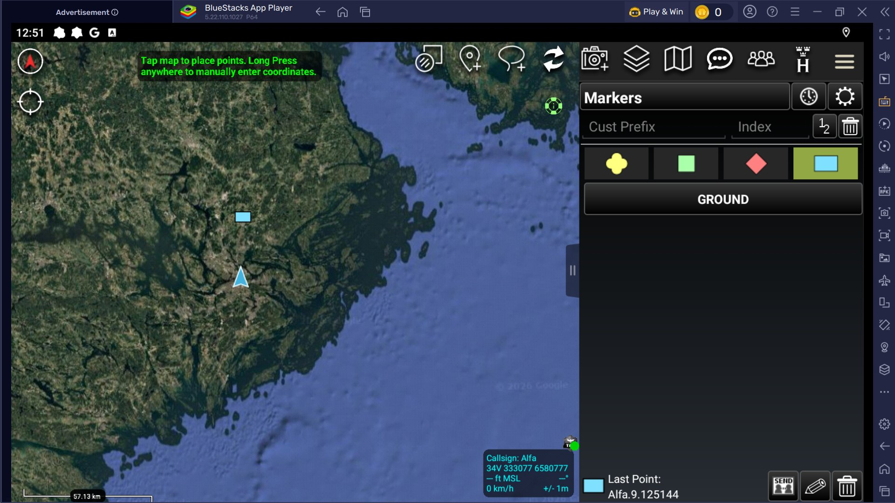
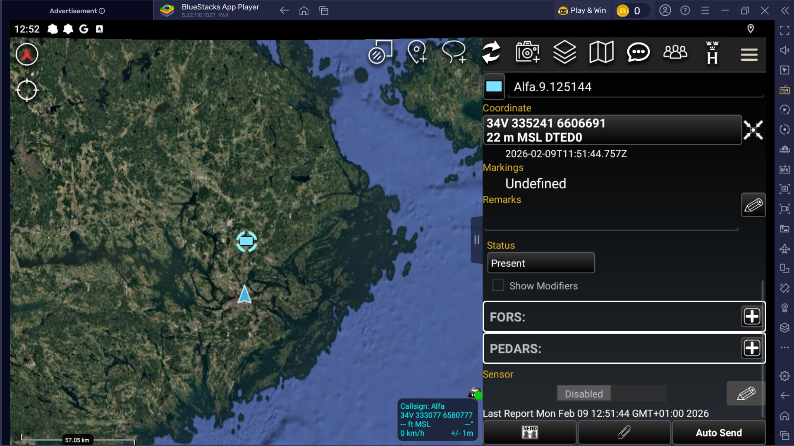

---

## RAMSOR:
- Under ”Hamburgaren” TOOLS, finns ikonen MNEMONICS (Ramsor)
- Det är en lathund för att komma ihåg alla funktioner en ramsa har:
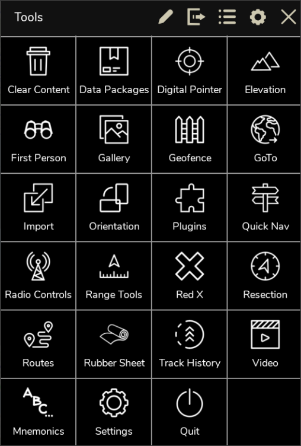
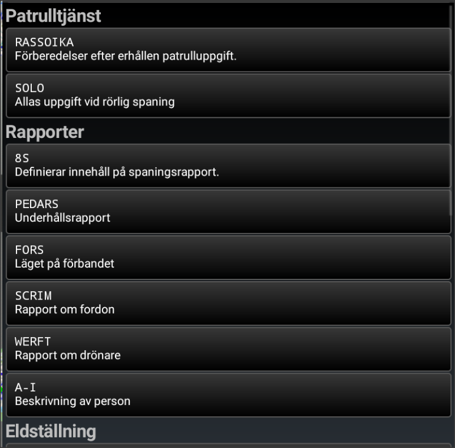
MNEMONICS

---

## FEED
FEED (SYNKRONISERAT INFORMATIONSFLÖDE)
- Med en FEED upprätthåller man läget på alla enheter som man skickar informationen till eller från
- För att kunna skap en FEED måste ATAK-SYNC vara installerad på enheten/enheterna
- FEED bygger man genom att använda anropssignalerna och sätt ihop dessa till gemensamma grupper, (den sparas på server och bara den  som skapar FEED är den som kan ta bort den från servern)
- Tex: AS - Eget läge
- Tex: QL - Fiende läge
- Tex : VJ – Gröna vägar
- Feeds kan tändas och släckas med ”ögat” vilket
- möjliggör enkel översikt över kartbilden.
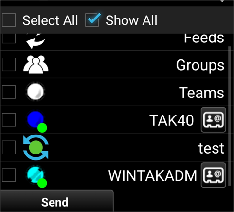
HELA BATALJONEN
Genom att sätta läs/skriv rättigheter och pinkod på FEED kan man styra hur man vill att informationen skall uppdateras

---

## FEED
- Feed är ett sätt att kommunicerar information med synkning.
- Alla ändringar i en befintlig feed autouppdateras till alla i feeden
- FEEDs på en bataljon skulle kunna vara följande tex:
BAT
8S  QV
Mineringar RV
KOMP
KOMP
8S AQ
TMM AR
Minering BQ
Gruppering BR
PLUT
PLUT
PLUT
PLUT
- VJ – Gröna vägar
- Alla ser samma information i nutid
G
G
G
G
8S EA
Gruppfeed
- AS – Eget läge
- Alla ser samma information i nutid

---

## HUR SKAPAR VI EN FEED I ATAK?
- Öppna: overlay manager
- Klicka:  Feeds
- Klicka: plus i ring
- Create new feed
- Välj default role: Read Only, då kan du senare ändra de användare som behöver skriva i feeden tillstånd
- Namnge feed tex: batled-kompaniledning eller bara bataljonen
- Klicka;  bakåtpil och done
- Klicka: TAK server
- Klicka på er skapade Feed
- Klicka: kugghjul med 2 vita pilar i cirkel uppe till höger
- Bredvid default role till höger klicka på: 3 personer bilden
- Invite others
- ANGE DE ENHETER SOM SKALL INGÅ I KOMMUNIKATIONSFLÖDET (alla enheter som är startade och finns i er ”Bataljon” är synliga)
- Klicka: Invite
- Sedan ok - Alla valda anropssignaler kommer att få en inbjudan till Feed ”namn” och från vem
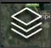
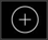
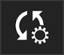
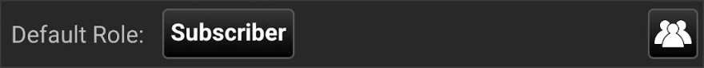

---

## Tools: Skapa Data packages

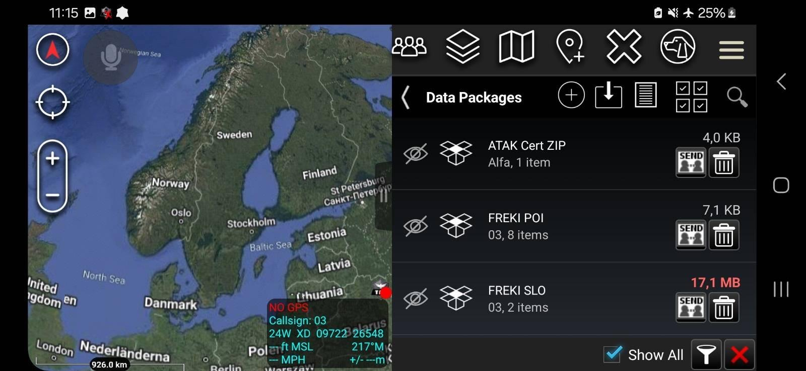
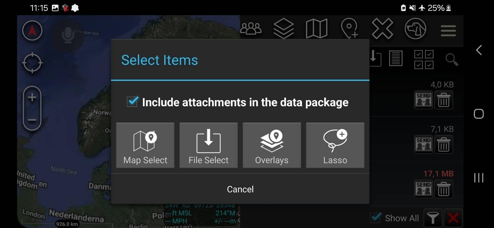
**Skapa nytt data package**

- Ikoner eller ritad information samt dokument kan inkluderas i DATA PACKAGE
- Välj filer från EUD (End User Device) lagringsminne
- Välj mellan specifik kategori eller enskild ikoner att inkl. i DATA PACKAGE
- Dra en cirkel runt de ikoner du vill inkl. i DATA PACKAGE (rekommenderas) eller välj Map select och klicka på det som skall ingå
- Välj select
- Välj new och döp till lämpligt namn enl CS-TNR-”Information”
- Klicka build
- Du kan nu skicka ditt datapaket genom att klicka send till höger
- Välj en användare eller till Server för att alla skall kunna hämta det via datapackage och download, eller via feed.

---

## OM TELEFONEN TAPPAR KONTAKTEN MED SERVERN (serverconnect.pdf)

> [!NOTE]
> Händer det efter en omstart räcker det inte alltid att ta bort
> anslutningen i ATAK med soptunneikonen. Ett gammalt `atak-box.zip` kan
> ligga kvar under `atak/tools/datapackage/` på telefonen och blockera
> registreringen. Radera då den filen från telefonens lagring också, innan
> du importerar `atak-box.zip` från Download igen.
- Denna information finns även på Telefonen under Download eller ATAK-Installation mappen
- Klicka på den röda pricken nere i högra hörnet av bilden på TAK skölden
- Klicka på Soptunnan
- Klicka yes
- Backa med pilen 1 ggr
- Klicka på ”Hamburgaren” uppe till höger
- Scrolla till import files
- Klicka: import files
- Klicka:  Local sd
- Bläddra till download
- Hitta: atak-box.zip
- Den kan ligga under Atak mappen under Download
- Klicka på: atak-box.zip
- Klicka :ok
- Klicka: COPY
- Klicka: ok
- Tak server registration successful
- Klicka: done
- OBS!!!   Kontroller ditt Call Sign och TEAM färg
- Inloggning
- Username
  - Password

---

## Uppstart och systemkonfiguration

**Anropssignaler (callsign).** Skilj strikt på personliga enheter
(individuell anropssignal, t.ex. RU1) och funktionsenheter (stabsdator
eller nod, t.ex. RU).

**Teamfärger.** Bat = svart, 1. komp = vit, 2. komp = orange. Pluton 1–4
ställs in internt. Grupp och soldat följer plutonens färgkodning. Se
[Färgsättning](#färgsättning) för hela schemat.

**Nivåmarkering (filtreringstagg).** Använd `#Bat`, `#Komp`, `#Plut`,
`#Grp` i fältet *Remarks*, så att högre staber snabbt kan filtrera fram
rätt beslutsnivå.

**Kritiska enhetsinställningar.** MGRS, MSL (meters), km/h, Numeric
Heading, Mils, Grid North.
Avvikelser skapar kritiska fel vid eldledning.

På en telefon som provisionerats med verktyget är de här redan satta —
se `[prefs.entries]` i `provision.toml`. Kontrollera ändå, och rätta för
hand om något avviker. Observera att självmarkörens ruta alltid visar
grader och `M` även när streck och gitternord är satta; den visningen
säger ingenting om de två inställningarna.

---

## Uppdateringsintervall mot server

Genom att justera rapporteringsintervallen får du antingen snabbare
uppdateringar eller bättre batteritid. Alla värden anges i sekunder.

1. ”Hamburgaren” → **Settings**.
2. **My Preferences**.
3. **Callsign and Device Preferences**.
4. **Reporting Preferences** — skrolla till fälten som slutar på
   *(Server)*.

| Inställning | Värde | Gäller |
|---|---:|---|
| Dynamic Reporting Rate Stationary (Server) | 180 | Stillastående |
| Dynamic Reporting Rate Minimum (Server) | 120 | Långsam rörelse |
| Dynamic Reporting Rate Maximum (Server) | 120 | Snabb rörelse |

Värdena ovan är utprovade. Motsvarande *(Mesh)*-fält gäller mesh-nätet
och lämnas orörda när enheten rapporterar mot TAK-server.

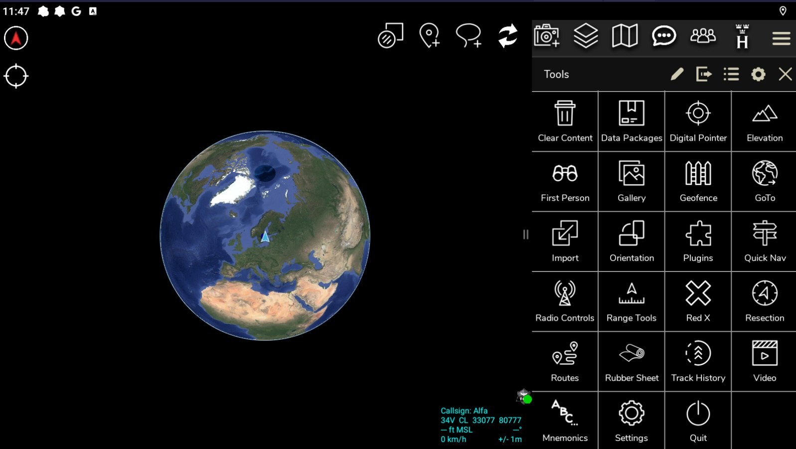

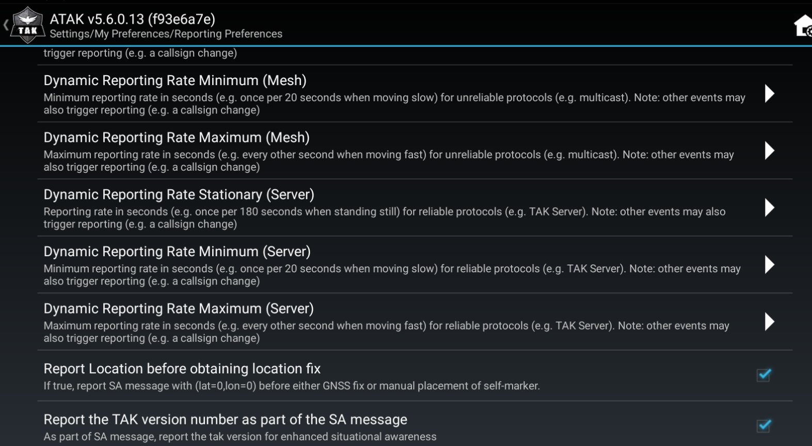
