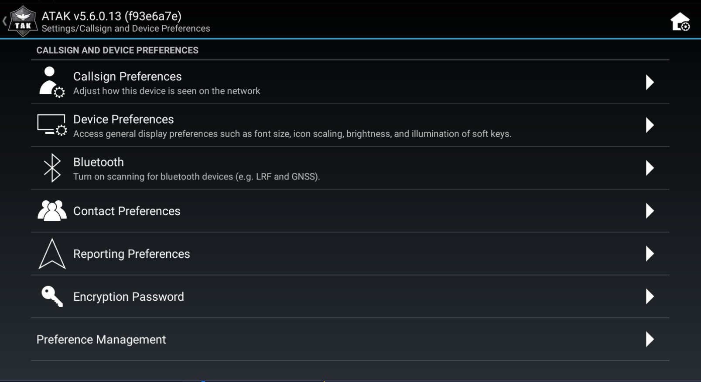
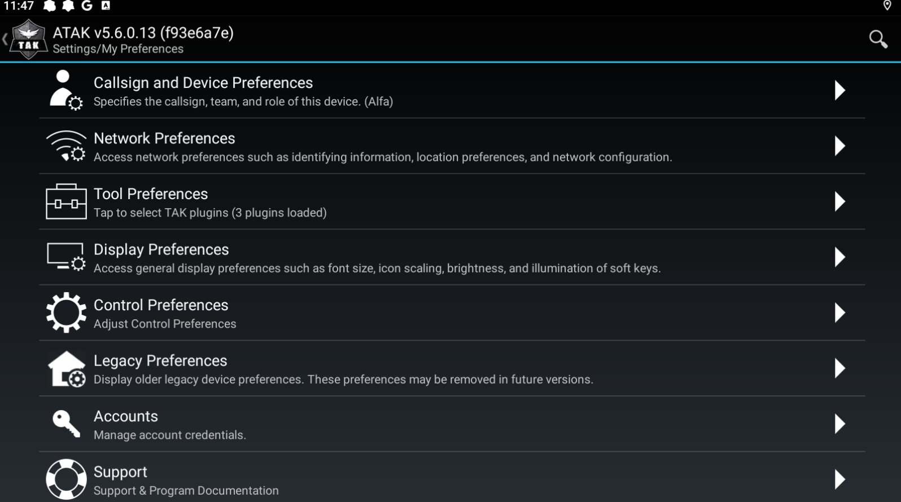

## 3
1
Ställ om uppdateringsintervall mot server

4
2

120
120
180
Genom att justera dessa så kan man få snabbare uppdateringar men även bättre batteritid (vi har testat värdena ovan) allt är i sekunder, översta uppdaterar långsammaste rörelserna osv
